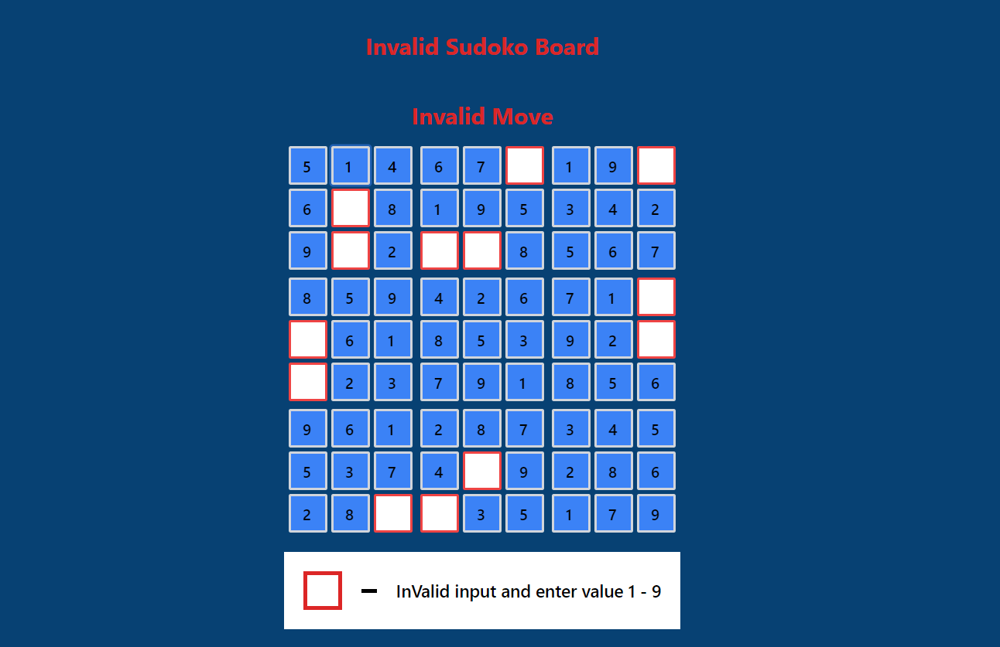
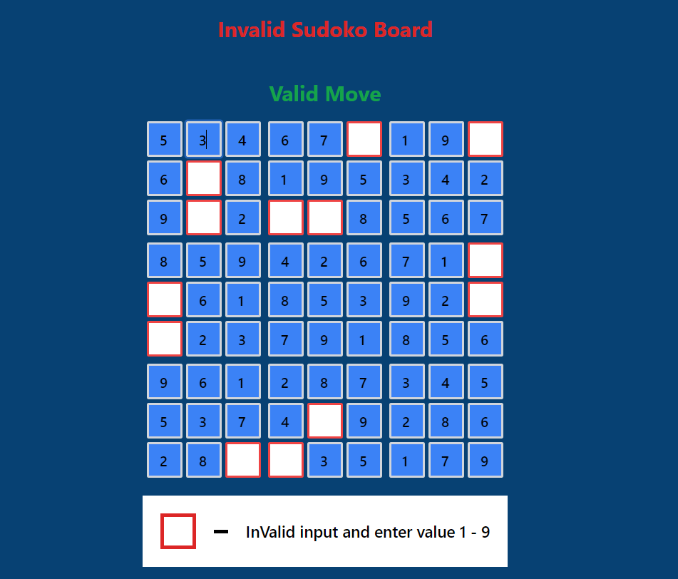
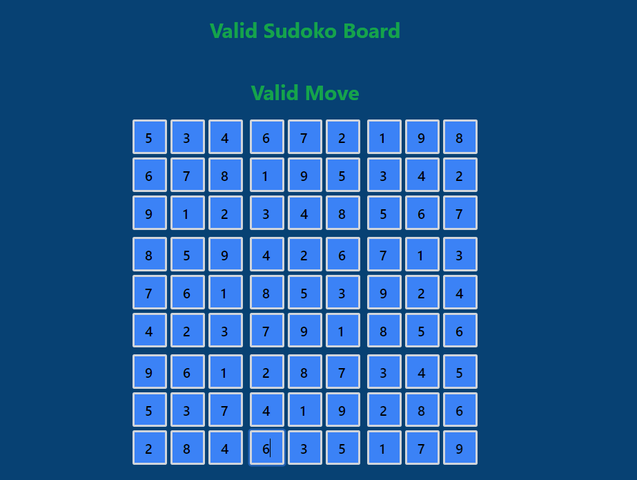
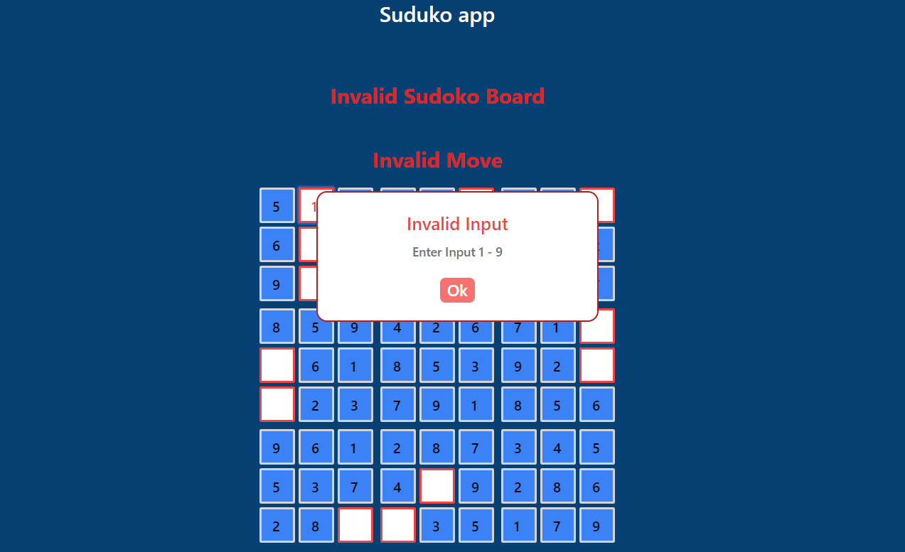

# Sudoko App
 Simple sudoko app to solve the suduko pattern of 9x9 grid.

 ## Screenshots
 - **ScreenShot 1**
 
 - **ScreenShot 2**
 
  - **ScreenShot 3**
 
  - **ScreenShot 4**
 

 ## Technology Used
 - HTML
 - Tailwindcss
 - React Js

 ## Features
- Check whether the move is valid or not
- Check whether the grid pattern of sudoku board is valid or not

